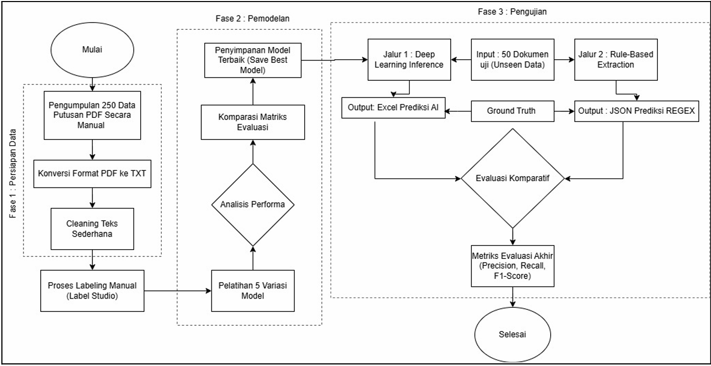

# Legal Entity Extraction using NLP & Deep Learning

## Overview

This project builds an automated system to extract structured information from Indonesian legal verdict documents using Natural Language Processing and deep learning techniques.

The objective is to transform unstructured legal text into usable structured data for faster legal analysis.

## Project Pipeline

The workflow of the legal entity extraction system is illustrated below:

The pipeline consists of three main stages:

1. Data Preparation — document collection, cleaning, and manual labeling
2. Modeling — training multiple extraction models
3. Evaluation — comparison between deep learning and rule-based approaches

## Dataset

* Indonesian criminal court verdict documents
* Unstructured text format
* Used for academic research purposes

## Models Implemented

* Regex baseline
* CRF
* BiLSTM
* BiLSTM-CRF
* IndoBERT

## Tech Stack

Python
PyTorch
Transformers
Scikit-learn

## Status

🚧 Repository under development

## Author

Indrayana Widhikartiko
